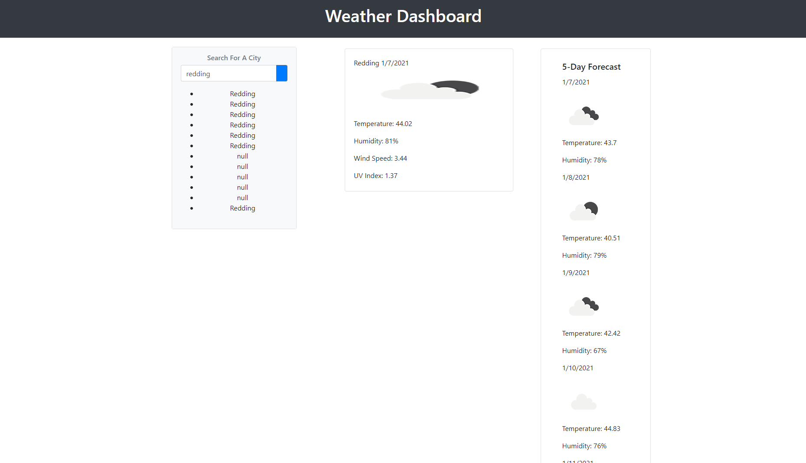

# Weather Dashboard
## Website Description

This Website allows the user to input a city and recieve the current temperature, humidity, wind speed, and UV Index for the city as weel as the 5 day forcast, provided by: OpenWeatherMap.

## Getting Started

These instructions will get you a copy of the project up and running on your local machine for development and testing purposes. See deployment for notes on how to deploy the project on a live system.

### Prerequisites

What things you need to install the software and how to install them

```
Github and Gitlab accounts
GitBash or Terminal
```

### Installing

A step by step series of examples that tell you how to get a development env running

```
Clone the code to your terminal
Pull from the repository
View on Visual Studio Code
```

## Built With

* [HTML](https://developer.mozilla.org/en-US/docs/Web/HTML)
* [CSS](https://developer.mozilla.org/en-US/docs/Web/CSS)
* [JavaScript](https://www.javascript.com/)
* [jQuery](https://jquery.com/)

## Deployed Link

* [See Live Site](https://hudsonmbarnes.github.io/weather/)

## What I did



## Code Snippet

This part of the code is the API variables from OpenWeatherMap for current and five day. The next part takes the user imput and puts it in local storage.

```
// Variables for current and five day weather
var urlCurrent = "https://api.openweathermap.org/data/2.5/weather?q=" + searchInput + "&Appid=" + apiKey + "&units=imperial";
var urlFiveDay = "https://api.openweathermap.org/data/2.5/forecast?q=" + searchInput + "&Appid=" + apiKey + "&units=imperial";

// Input response for search
if (searchInput == "") {
    console.log(searchInput);
} else {
    $.ajax({
        url: urlCurrent,
        method: "GET"
    }).then(function (response) {
        var cityName = $(".list").addClass("list-item");
        cityName.append("<li>" + response.name + "</li>");
// Local storage
        var local = localStorage.setItem(userInput, response.name);
        userInput = userInput + 1;
```

## Editors

* **Hudson Barnes**
- [Link to Github](https://github.com/hudsonmbarnes)
- [Link to LinkedIn](https://www.linkedin.com/in/hudson-barnes-398483151/) 


## Authors

* **Hudson Barnes** 


## Acknowledgments

* W3schools.com
* stackoverflow.com
* google.com
* github.com